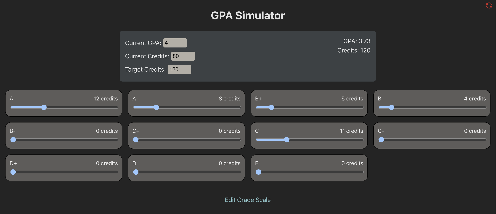

# GPA Tool
A special GPA calculator that allows you to experiment with different grades and see how they affect your GPA. Unlike other calculators that have you enter in specific grades, this calculator only needs your current GPA, credit count, and credit target. Then, you can move around the various sliders and watch how your GPA will change.




## Technologies
- [TypeScript](https://www.typescriptlang.org/download)
- [Vue 3](https://v3.vuejs.org/guide/introduction.html)

## Installation

```
git clone https://github.com/andrewctam/gpa-tool.git

cd gpa-tool

npm install

npm run dev
```
